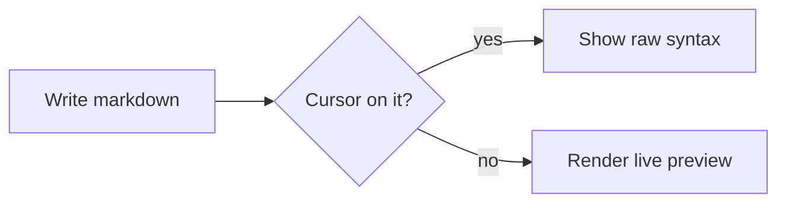

# Typodown

Markdown renders where you type. Move your caret into a **bold term**, `code span` or [link](/) and its raw markers surface while you edit, then settle back into place.

## Why?

[**Typora**](https://typora.io) nailed markdown editing: you edit the rendered document directly. But Typora is a closed-source desktop app, so that experience stops at its window.

[**Marktext**](https://marktext.me/) came up with a really good open-source alternative to Typora. However, as a long time Typora user, a few things were not feeling right:

- Marktext is not as minimalist as Typora. It has a different design philosophy where it shows all available actions on the screen. Which might be good for some users, but not zen enough for me.
    - Every time I click a different line, a button moves in the left margin; every time I highlight some characters, a toolbar pops on top of the selection. Too many unnecessary movements on the screen to me.
    - Codeblocks ``` could be always hidden, no need to reveal them; frontmatter does not need a "front matter delimiter" written all around it, etc.
- Despite 10+ themes I could not find a good imitation of GitHub style markdown rendering, which is arguably the style developers are the most exposed to. And custom CSS seems to have its limitations (I could not figure out how to make the `<hr>` a plain line instead of the default dotted line)

**Typodown** brings Typora's editing experience to the open-source world, the web, VSCode and smartphones, with a minimalist design, GitHub style rendering, and more.

## Usage

Typodown ships in several forms, and table columns can be left, center, or right aligned:

| Form                                                                                                                                                                                                                                                                                                                                                                                                                                                                                                                        |                                       Description                                       |                                                                              Get it |
| :-------------------------------------------------------------------------------------------------------------------------------------------------------------------------------------------------------------------------------------------------------------------------------------------------------------------------------------------------------------------------------------------------------------------------------------------------------------------------------------------------------------------------- | :-------------------------------------------------------------------------------------: | ----------------------------------------------------------------------------------: |
| <svg viewBox="0 0 24 24" width="16" height="16"><path fill="#0098FF" d="M23.15 2.587L18.21.21a1.494 1.494 0 0 0-1.705.29l-9.46 8.63-4.12-3.128a.999.999 0 0 0-1.276.057L.327 7.261A1 1 0 0 0 .326 8.74L3.899 12 .326 15.26a1 1 0 0 0 .001 1.479L1.65 17.94a.999.999 0 0 0 1.276.057l4.12-3.128 9.46 8.63a1.492 1.492 0 0 0 1.704.29l4.942-2.377A1.5 1.5 0 0 0 24 20.06V3.939a1.5 1.5 0 0 0-.85-1.352zm-5.146 14.861L10.826 12l7.178-5.448z"/></svg> **VSCode extension**                                                    |                      Edit `.md` files with Typodown inside VSCode                       | [Marketplace](https://marketplace.visualstudio.com/items?itemName=vemonet.typodown) |
| <svg viewBox="0 0 24 24" width="16" height="16" fill="none" stroke="currentColor" stroke-width="2" stroke-linecap="round" stroke-linejoin="round"><path d="M21 15v4a2 2 0 0 1-2 2H5a2 2 0 0 1-2-2v-4"/><polyline points="7 10 12 15 17 10"/><line x1="12" y1="15" x2="12" y2="3"/></svg> **Desktop app**                                                                                                                                                                                                                    | Open a folder of `.md` files, with file explorer and graph view (Linux, macOS, Windows) |                            [Releases](https://github.com/vemonet/typodown/releases) |
| <svg viewBox="0 0 28.99 31.99" width="16" height="16" aria-hidden="true"><path d="M13.54 15.28.12 29.34a3.66 3.66 0 0 0 5.33 2.16l15.1-8.6Z" fill="#ea4335"/><path d="m27.11 12.89-6.53-3.74-7.35 6.45 7.38 7.28 6.48-3.7a3.54 3.54 0 0 0 1.5-4.79 3.62 3.62 0 0 0-1.5-1.5z" fill="#fbbc04"/><path d="M.12 2.66a3.57 3.57 0 0 0-.12.92v24.84a3.57 3.57 0 0 0 .12.92L14 15.64Z" fill="#4285f4"/><path d="m13.64 16 6.94-6.85L5.5.51A3.73 3.73 0 0 0 3.63 0 3.64 3.64 0 0 0 .12 2.65Z" fill="#34a853"/></svg> **Android app** |                  Open `.md` files straight from your file storage app                   |                            [Releases](https://github.com/vemonet/typodown/releases) |
| <svg viewBox="0 0 24 24" width="16" height="16"><path fill="#CB3837" d="M1.763 0C.786 0 0 .786 0 1.763v20.474C0 23.214.786 24 1.763 24h20.474c.977 0 1.763-.786 1.763-1.763V1.763C24 .786 23.214 0 22.237 0zM5.13 5.323l13.837.019-.009 13.836h-3.464l.01-10.382h-3.456L12.08 19.17H5.113z"/></svg> **npm package**                                                                                                                                                                                                         |                   Embed the editor in any web app, framework-agnostic                   |              [`@vemonet/typodown`](https://www.npmjs.com/package/@vemonet/typodown) |

> Hit <kbd>Ctrl/⌘</kbd> + <kbd>/</kbd> to toggle the editor's rendered/raw mode, in case you need full control.

### 🧩 VSCode extension

Install **Typodown** from the [Marketplace](https://marketplace.visualstudio.com/items?itemName=vemonet.typodown), then open any `.md` file and launch the editor from:

- the **Open with Typodown** button in the editor title bar,
- the explorer **right-click** context menu, or
- the command palette: **Typodown: Open with Typodown** / **Open with Typodown to the Side**.

The text file stays the single source of truth, so Typodown works alongside VSCode's text editor, source control and undo/redo.

> [!TIP]
> To make it the default editor for Markdown, run **View: Reopen Editor With... → Configure default editor for `*.md`**.

By default the editor follows your VSCode color theme. Pin it to a GitHub-like light or dark theme with the `typodown.theme` setting (`editor` | `light` | `dark`).

### 🖥️ Desktop app

Open a folder of markdown files, with a file explorer tree on the left. You can also open a single `.md` file, or just double-click a `.md` file in your file manager.

Additionally the app enables a **graph view** built from files using the [Open Knowledge Format (OKF)](https://github.com/GoogleCloudPlatform/knowledge-catalog/tree/main/okf): see how your notes link to each other, and jump to any node.

### 🌐 Progressive Web App

[Open Typodown Vault](https://typodown.app/vault/) to edit a local folder directly in your browser, with the same file explorer, editor and graph view as the desktop app. It can also be installed as a PWA for a standalone app experience.

> [!WARNING]
> Typodown Vault requires a Chromium-based browser because it uses the [File System Access API](https://developer.mozilla.org/en-US/docs/Web/API/Window/showDirectoryPicker) to read and write your selected folder. Firefox and Safari are not currently supported. Your files remain local and are not uploaded.

### 📱 Android app

Open a `.md` file with Typodown straight from your file or storage app: git, Dropbox, Google Drive, Nextcloud, anything exposing a writable Android documents provider works; there is no per-provider integration. With Dropbox you will need to save the `.md` file on device to be able to edit it with Typodown.

A floating toolbar brings formatting actions to touch screens where keyboard shortcuts are out of reach.

### 📦 npm package

Embed the editor in any web app, framework-agnostic, built with [CodeMirror 6](https://codemirror.net/). Install it from npm:

```sh
npm i --save @vemonet/typodown
```

Then mount it on any element:

```ts
import { createTypodown } from "@vemonet/typodown";
import "@vemonet/typodown/style.css";

const editor = createTypodown(document.getElementById("editor")!, {
  value: "# Hello",
  theme: "auto", // "light" | "dark" | "auto"
  placeholder: "Write some markdown...",
  onChange: (markdown) => console.log(markdown),
});

editor.getValue(); // read the current markdown
editor.setValue("new **content**");
editor.setTheme("dark");
editor.focus();
editor.destroy();
```

> [!TIP]
> A standalone UMD build (CodeMirror bundled in) is also available on [unpkg](https://unpkg.com) / [jsDelivr](https://www.jsdelivr.com), exposing a `Typodown` global for use from plain HTML with no bundler.

## Features

### Inline formatting

Write **bold**, _italic_, **_bold italic_**, ~~strikethrough~~, `inline code`, and footnotes[^1].

Select some text and press <kbd>Ctrl/⌘</kbd> + <kbd>B</kbd>, <kbd>Ctrl/⌘</kbd> + <kbd>I</kbd>, or <kbd>Ctrl/⌘</kbd> + <kbd>K</kbd> to format it.

### Lists

Unordered lists nest with different bullets per level (Tab / ⇧+Tab):

- Fruit
    - Apple
    - Banana
        - Cavendish
- Vegetables

Ordered lists keep their starting number:

3. Third item
4. Fourth item
5. Fifth item

Task lists stay interactive:

- [x] Parse GitHub Flavored Markdown
- [ ] Create new JS framework

### Alerts

> A plain blockquote.

> [!NOTE]
> Useful information that users should know, even when skimming.

> [!IMPORTANT]
> Key information users need to know to achieve their goal.

> [!WARNING]
> Urgent info that needs immediate user attention to avoid problems.

> [!CAUTION]
> Advises about risks or negative outcomes of certain actions.

Directive containers used by documentation sites are supported too:

:::note
Useful context can be written as regular Markdown inside the container.
:::

:::tip Custom label
Add a label after the directive type to replace the default title.
:::

:::danger[Destructive action]
Docusaurus-style bracket labels work too.
:::

### Mermaid diagrams

Fenced code blocks with the `mermaid` language render as live diagrams when idle, and reveal their raw source when you click into them:



### LaTeX maths

Inline maths like $f = \frac{2\pi}{T}$ and $E = mc^2$ renders with KaTeX, and reveals its raw `$...$` source when you click into it. Block maths with `$$` renders centred on its own line:

$$
\int_{-\infty}^{\infty} e^{-x^2}\,dx = \sqrt{\pi}
$$

Single-line block maths works too: $$\sum_{n=1}^{\infty} \frac{1}{n^2} = \frac{\pi^2}{6}$$

### Image


### Raw HTML

Raw HTML renders in place, and reveals its source when the caret lands on it, just like markdown syntax. It is on by default; pass **html: false** to turn it off.

<div style="padding: 12px; border-left: 3px solid var(--td-link); background: var(--td-block-bg); border-radius: 0 6px 6px 0;">
  <strong>Custom callout</strong> built from a block of inline-styled HTML.
</div>

<details>
  <summary>Collapsible section (click to expand)</summary>
  Hidden content inside a native <code>details</code> element.
</details>

Inline HTML like <kbd>Ctrl</kbd> + <kbd>K</kbd>, <span style="color: var(--td-caution);">colored text</span>, subscript H<sub>2</sub>O, and <small>small print</small> all work too.

### Themes

Available themes: `light`, `dark`, `system`, `dracula`, `nord`, `solarized-light`, `solarized-dark`

Define a custom theme:

```css
.typodown[data-td-theme="rose-pine"] {
  --td-bg: #191724;
  --td-fg: #e0def4;
  --td-muted: #908caa;
  --td-faint: #6e6a86;
  --td-border: #403d52;
  --td-border-muted: #26233a;
  --td-heading-border: #403d52;
  --td-link: #c4a7e7;
  --td-code-bg: rgba(110, 106, 134, 0.2);
  --td-code-fg: #e0def4;
  --td-block-bg: #1f1d2e;
  --td-code-block-bg: #1f1d2e;
  --td-table-header-bg: #26233a;
  --td-table-alt-bg: #1f1d2e;
  --td-selection: rgba(196, 167, 231, 0.3);
}
```

[^1]: Footnotes are useful for citations and additional context. They appear at the bottom of the document.

---

# Torture test

Everything below is the nasty half: deep indentation, containers inside containers, and fences nested as far as markdown lets them go.

> [!NOTE]
> Whenever a weird rendering or editing bug gets fixed, append a minimal
> reproduction to the [Regressions](#regressions) section at the bottom so it
> stays covered by eye as well as by unit tests.

## Indented code blocks

Four leading spaces is a code block, no fence needed:

    plain indented code block
      keeps its own inner indentation
    and ends when the indentation stops

Tab-indented too:

	tab indented code block

An indented code block right after a list, separated by a blank line, belongs
to the document and not to the list:

- a list item

<!-- comment breaks the list so the block below is not a list continuation -->

    not a list continuation

## Fenced code inside lists

- a list item with a fence at 4 spaces (the default indent width):

    ```json
    {
      "answer": 42,
      "indented": ["the code must keep its own indentation", "not the list's"]
    }
    ```

- a list item with a fence at 2 spaces:

  ```json
  {
    "answer": 42,
    "indented": ["the code must keep its own indentation", "not the list's"]
  }
  ```

- and a second item, to prove the bullet survives:

  ```sh
  echo "still a list item"
  ```

1. ordered item with a fence at 3 spaces:

   ```py
   def f():
       return "inner indentation preserved"
   ```

2. nested deeper:

   - level 2 bullet

     ```ts
     const deep = "fence at 5 spaces";
     ```

     - level 3 bullet

       ```ts
       const deeper = "fence at 7 spaces";
       ```

## Blockquotes, labels and indentation

> plain quote
>
> > nested quote
> >
> > > triple nested quote

> [!TIP]
> An alert containing a list:
>
> - first
> - second
>   - nested
>
> and a fenced code block:
>
> ```sh
> echo "fence inside a blockquote"
> ```

> [!WARNING]
> An alert containing another quote:
>
> > quoted inside an alert
> >
> > ```json
> > { "fence": "inside a quote inside an alert" }
> > ```

- a list item containing an alert:

  > [!IMPORTANT]
  > Alerts nest inside list items too.
  >
  > ```sh
  > echo "fence inside an alert inside a list item"
  > ```

:::warning Directive with a label wrapping other blocks
A directive container holding a list, a quote and a fence:

- one
- two

> quoted inside a directive

```sh
echo "fence inside a directive"
```

:::

:::note[Bracket label with `code` and **bold**]
Labels are inline markdown too.
:::

> [!WARNING]
>
> To run test of federated queries docker needs to be installed, and `$DOCKER_HOST` environment variable needs to be set, otherwise they will be skipped. On macOS with orbstack you can add this to your `~/.zshrc`:
>
> ```sh
> export DOCKER_HOST=unix:///Users/$(whoami)/.orbstack/run/docker.sock
> ```
>
> To stop and delete all running containers you can run:
>
> ```sh
> docker stop $(docker ps -a -q) && docker rm $(docker ps -a -q)
> ```

## Nested fences

CommonMark closes a fence only on a run of the _same or more_ backticks, so
fences nest by widening the outer fence. Four levels:

`````md
Outer fence: 5 backticks. Everything here is literal markdown.

````md
Second level: 4 backticks.

```md
Third level: 3 backticks.

    and a 4-space indented code block inside it,
    which needs no fence at all
```
````
`````

Tildes nest independently of backticks, so a `~~~` fence can hold a ` ``` `
fence at the same width:

~~~md
```json
{ "backtick fence": "inside a tilde fence of the same width" }
```
~~~

And the reverse:

```md
~~~json
{ "tilde fence": "inside a backtick fence of the same width" }
~~~
```

Nested fences inside a list, at 2-space indentation:

- documenting how to document:

  ````md
  ```sh
  npm i --save @vemonet/typodown
  ```
  ````

Nested fences inside a blockquote:

> ````md
> ```sh
> echo "two levels deep, inside a quote"
> ```
> ````

## Awkward but legal

An unclosed fence at end of container closes with the container:

- item
  ```sh
  echo "fence closed by the end of the list item"

- next item

A fence with no language and a blank line in the middle:

```

still one code block

```

A fence whose info string has attributes:

```ts title="example.ts" {2-3}
const a = 1;
const b = 2;
const c = 3;
```

A fence containing the frontmatter delimiter:

```md
---
type: not-frontmatter
---
```

A fence containing an alert and a directive that must stay literal:

```md
> [!NOTE]
> Not a real alert, just text in a code block.

:::tip Not a real directive
:::
```

Hard line break with two trailing spaces:

line one
line two

Escaped markers that must render literally: \*not italic\*, \`not code\`,
\# not a heading, \> not a quote, \- not a list.

A table containing pipes, code and a fence-looking span:

| Syntax  | Escaped pipe | Code span               |
| ------- | ------------ | ----------------------- |
| ` ``` ` | a \| b       | `` `backtick inside` `` |
| `~~~`   | c \| d       | `a \| b`                |

# Setext headings

## Second level setext

## Regressions

One minimal example per fixed bug. Append here, never edit an existing one.

### HTML comments stay visible but dimmed

Visible <!-- inline comment --> text.

<!--
# Commented-out heading
- Commented-out item
-->

### Fenced code in a list indents the fence, not the code

- item

  ```json
  {
    "answer": 42
  }
  ```

### List bullets survive a fence as the item's first block

- [`rtk`](https://github.com/rtk-ai/rtk) to reduce tools token usage

- ```sh
  brew install rtk
  ```

- ```sh
  rtk init -g
  ```

### Find & replace highlights every match

Search for `markdown` with <kbd>Ctrl/⌘</kbd> + <kbd>F</kbd>: every match in the
document must stay highlighted while the panel is open, and the counter must
match the number of occurrences. markdown, markdown, MARKDOWN, Markdown.

### Inline code and bold wrap the whole file name

Put the caret anywhere in test.md and hit the inline-code button: the extension
must be inside the backticks (`test.md`, not `test`.md). A sentence's own full
stop stays outside, as in the end.

### The caret sits one space right of a bullet or checkbox

Press Enter at the end of either item below: the caret must land where the first
typed character will appear, not hard against the marker.

- a bullet item
- [ ] a checkbox item

### A code block inside a labelled quote block keeps the quote's gutter

> [!IMPORTANT]
> No empty line above the block, no bleeding out of the alert, and the accent
> runs down the whole thing:
>
> ```sh
> echo "inside the alert"
> ```
>
> Nested one level deeper, the block indents with the quote:
>
> > ```sh
> > echo "inside a quote inside the alert"
> > ```

### Nested blockquotes indent

> depth 1
>
> > depth 2
> >
> > > depth 3

### An outline never lists headings from inside a fence

The document outline must show only this section's own heading: the fenced
example below closes on its outer delimiter, so nothing inside it is a heading.

````md
```md
# not in the outline
---
type: not-frontmatter
---
```
````

### A click lands where you clicked

Revealing a construct's raw syntax adds or removes whole lines, so a click used
to leave the caret up and to the left of the pointer. Park the caret on the
blank line below this paragraph, then click somewhere in the code block: the
caret must appear exactly where the pointer is, not a line or two above it.

```ts
const editor = createTypodown(document.body, { theme: "auto" });
editor.setValue("# clicked here");
```
